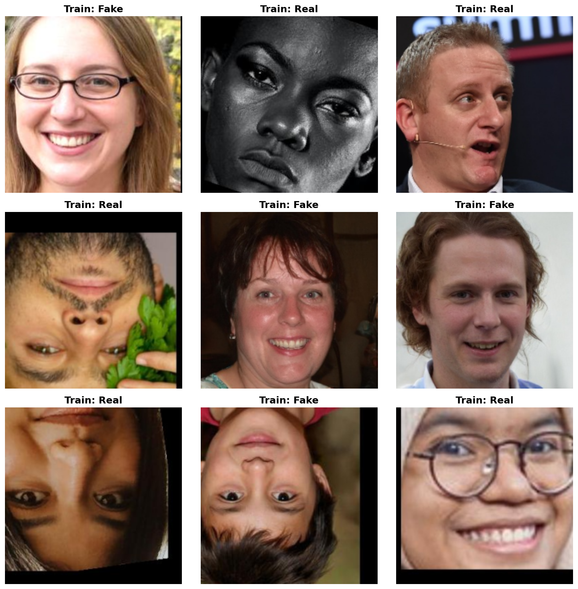
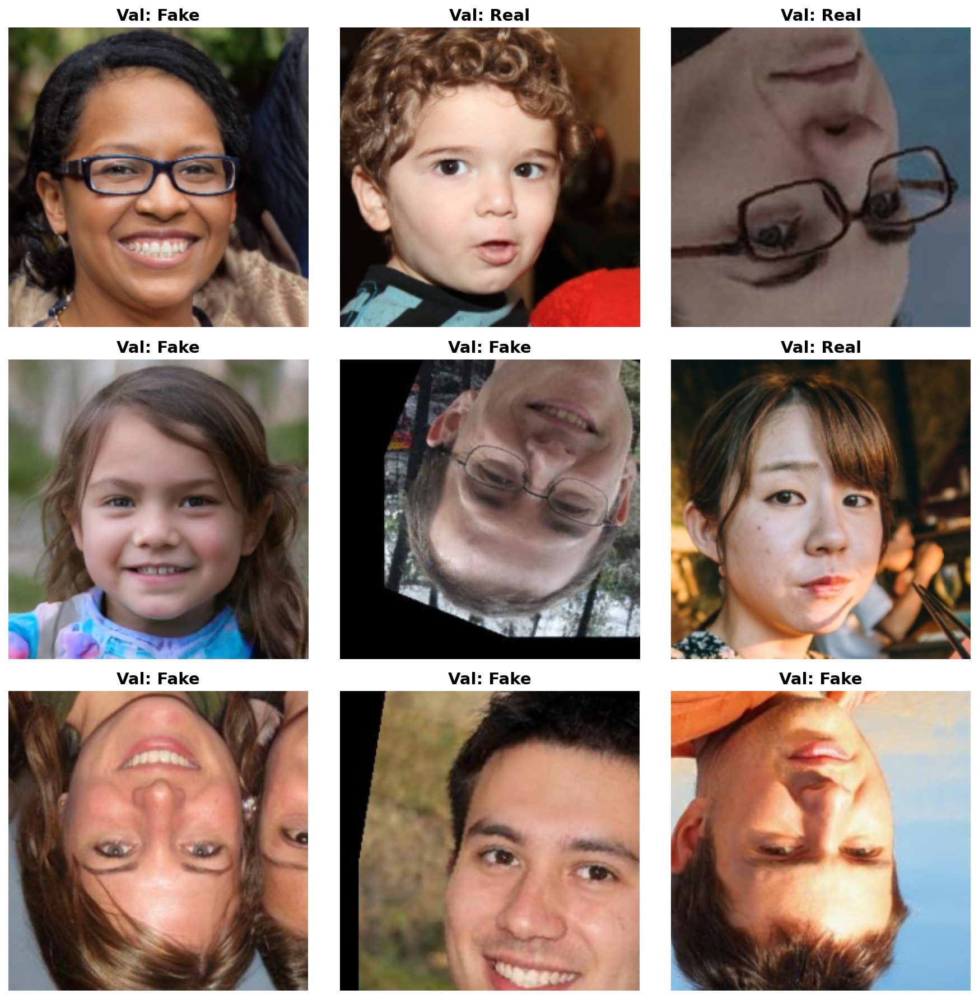
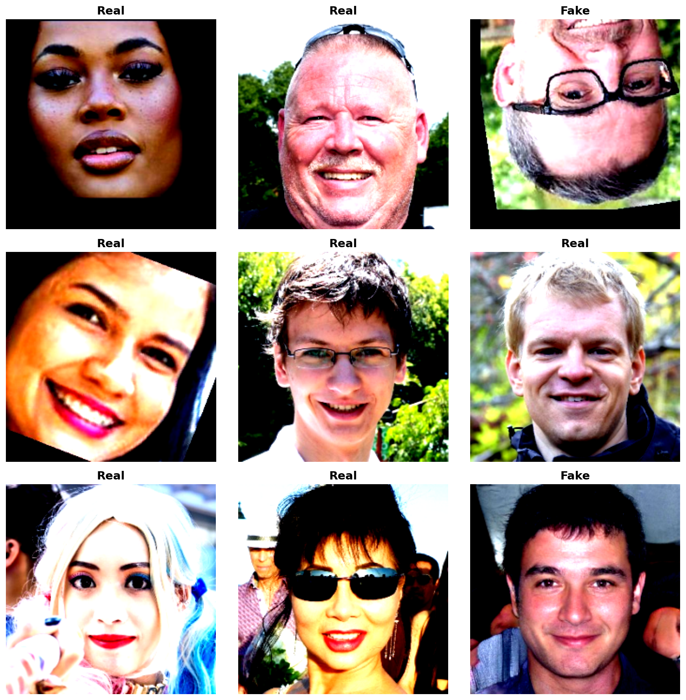
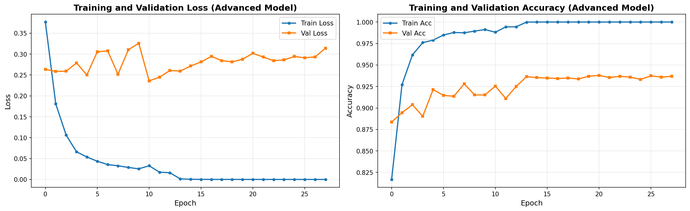
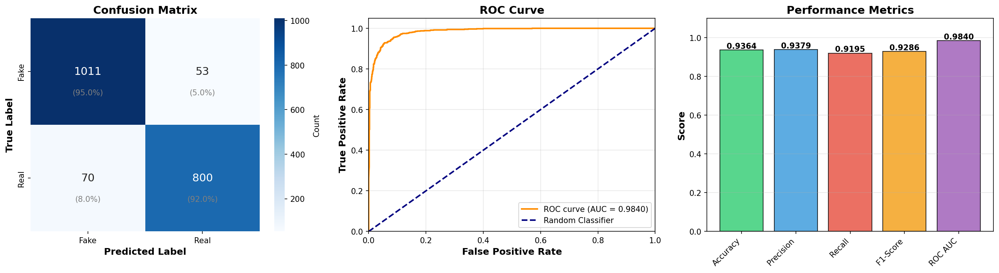

<<<<<<< HEAD
# Deepfake Face Detection

## Dataset Visualization

Sample images from the dataset (Train & TEST):




Sample Transformed Images (before model predicts):



The dataset contains:
- **Real faces**: 5,890 images
- **Fake faces**: 7,000 images
- **Total**: 12,890 images

Images are organized in a standard ImageFolder structure with `Real` and `Fake` subdirectories.


## Advanced Model: ResNet50 with Frequency Domain Features

### Overview
To improve deepfake detection, we developed an advanced model that leverages both spatial and frequency domain features. This approach exploits the fact that deepfake generation often leaves subtle artifacts in the frequency domain that are imperceptible in the spatial domain.

### Advanced Feature Extraction

The model processes images through **6 feature channels**:

#### 1. **Color Space Transformation (YCbCr)**
- Converts RGB to YCbCr color space
- Separates luminance (Y) from chrominance (Cb, Cr)
- Better captures color artifacts in fake images

#### 2. **FFT Magnitude Spectrum**
- Computes 2D Fast Fourier Transform on Y channel
- Extracts frequency domain features
- Detects periodic patterns and compression artifacts
- Log-scaled and normalized for stability

#### 3. **DCT Coefficients**
- Applies Discrete Cosine Transform (used in JPEG compression)
- Captures compression-related artifacts
- Reveals inconsistencies in fake image generation

#### 4. **Wavelet Transform (Haar)**
- Performs 2D Discrete Wavelet Transform
- Extracts high-frequency details (edges, textures)
- Sensitive to manipulation artifacts
- Uses horizontal detail coefficients (cH)

**Feature Stack**: [Y, Cb, Cr, FFT, DCT, Wavelet] → 6 channels

### Model Architecture

**Base**: Pretrained ResNet50 (modified for 6-channel input)

**Key Modifications**:
- **First Conv Layer**: Modified to accept 6 channels instead of 3
  - Weights initialized by duplicating pretrained RGB weights
- **Classification Head**: 
  ```
  Dropout(0.5) → Linear(2048→512) → ReLU → Dropout(0.3) → Linear(512→2)
  ```
- **Total Parameters**: ~25.6M trainable parameters

### Class Imbalance Handling
- **Class Weights**: Computed using sklearn's `compute_class_weight`
- **Weighted Loss**: CrossEntropyLoss with class weights
- Balances the 5,890 real vs 7,000 fake image disparity

### Training Configuration
- **Optimizer**: Adam (lr=0.0001, weight_decay=1e-4)
- **Scheduler**: ReduceLROnPlateau (factor=0.5, patience=3)
- **Early Stopping**: Patience of 7 epochs
- **Data Split**: 70% train, 15% validation, 15% test
- **Batch Size**: 32

### Training History


### Advanced Model Results



================================================================================
TEST SET EVALUATION RESULTS
================================================================================
Accuracy:  0.9364 (93.64%)
Precision: 0.9379
Recall:    0.9195
F1-Score:  0.9286
ROC AUC:   0.9840
================================================================================

Classification Report:
              precision    recall  f1-score   support

        Fake     0.9352    0.9502    0.9427      1064
        Real     0.9379    0.9195    0.9286       870

    accuracy                         0.9364      1934
   macro avg     0.9366    0.9349    0.9356      1934
weighted avg     0.9364    0.9364    0.9363      1934


### Why This Approach Works

1. **Multi-Domain Analysis**: Combines spatial (RGB, YCbCr) and frequency (FFT, DCT, Wavelet) features
2. **Artifact Detection**: GAN-generated images often have:
   - Periodic patterns in FFT spectrum
   - Unusual DCT coefficient distributions
   - High-frequency inconsistencies in wavelet domain
3. **Transfer Learning**: Leverages pretrained ResNet50 knowledge
4. **Regularization**: Heavy dropout prevents overfitting to training artifacts

### References
- **YCbCr Color Space**: Better for human perception and artifact detection
- **FFT Analysis**: Reveals global frequency patterns
- **DCT**: Standard in JPEG compression, captures compression artifacts
- **Wavelet Transform**: Multi-resolution analysis for edge detection
=======
# deepfake
>>>>>>> 21a9813e8282720858c6d08d417da59838d80397
